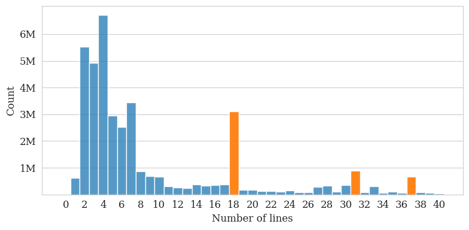

File statistics
================

The following tables present basic statistics on the collected robots.txt files and their development over the years. The statistics are furthermore aggregated for 16 website categories. For categorizing the websites, we employed the [Curlie](https://curlie.org/) top level label (Example: https://**cnn.com**/robots.txt -> News). Note that the human-curated, filtered Curlie directory contains links to less than one million of hosts and consequently most robots.txt files remain unlabeled.

We furthermore looked at the distribution of files sizes and the number of lines in the robots.txt files, yielding an interesting insight. The usage of some file templates of Content Management Systems, such as [wix.com](https://www.wix.com/) or [WordPress](https://wordpress.com/), are so popular that they lead to significant peaks in the length distribution.
