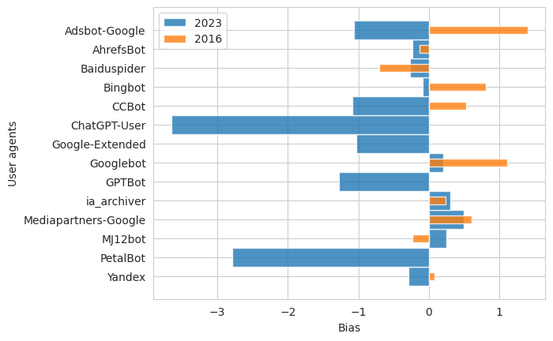

User agent bias
===============
        
Previous studies on robots.txt files, such as [Sun et al](https://dl.acm.org/doi/10.1109/WI.2007.45), discuss a potential bias towards specific user agents. The hypothesis is that there exists a web-wide trend on the aversion of site owners and hence some crawlers are generally restricted to the access of smaller parts of websites than others. The analysis shows that such a bias definitely exists. Most notably, our study highlights that the bias in robots.txt files favors Googlebot, AdsBot-Google and Mediapartners-Google, reflecting Google's dominance. Conversely, agents like CCBot, Google-Extended and GPTBot face increasing blocks, highlighting concerns about data control related to the development of generative AI tools. The following plot denotes the bias among user agents in 2016 and 2023, as defined by Sun et al. A positive bias means that the web agents are more favored than the global user agent, whereas a negative value indicates that the corresponding crawlers are restricted to less content in comparsion to the global user agent.



The analysis comprises 14 product tokens (AdsBot-Google, AhrefsBot, Baiduspider, Bingbot, CCBot, ChatGPT-User, Googlebot, Google-Extended, GPTBot, ia_archiver, Mediapartners-Google, MJ12bot, PetalBot, Yandex) as well as the global user agent. Note that the bias value defined by Sun et al is a rather course heuristic as it basically counts the `disallow` instructions per user agent. However, it remains unclear how big is the part of the website, which is actually covered by the URL path in the `disallow` statement. We have therefore thought about a complementary bias measure by counting the number of the *disallow all* instructions per user agent. This value is set in relation to the total number of appearences of the respective user agent in robots.txt files.

Example:
```robots
User-agent: GPTBot
Disallow: /
```

We assume a *disallow all* statement if the robots.txt file contains a `disallow` instruction with the URL path `/` and therefore categorically excludes all crawling activities of the corresponding web agent.